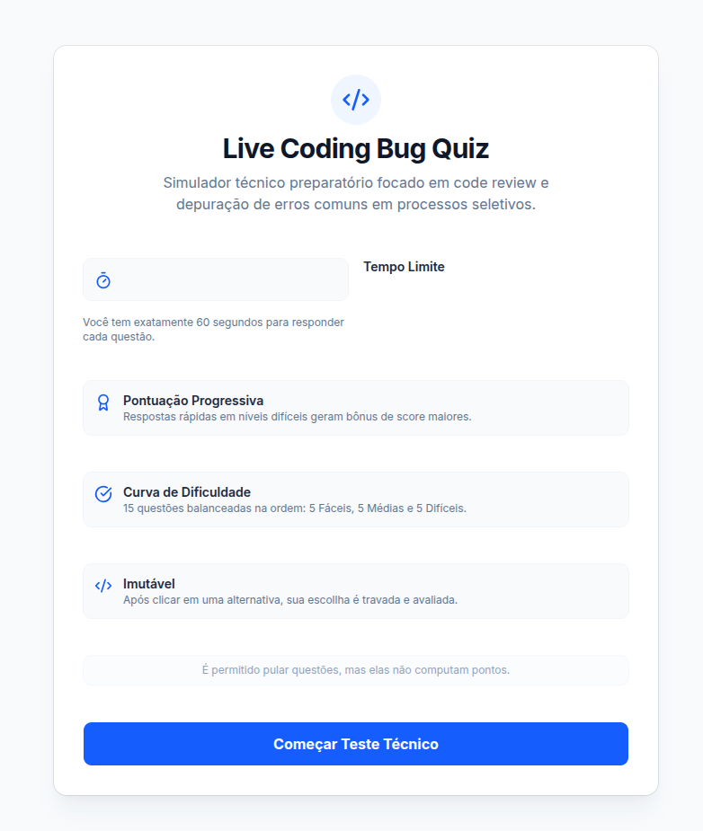
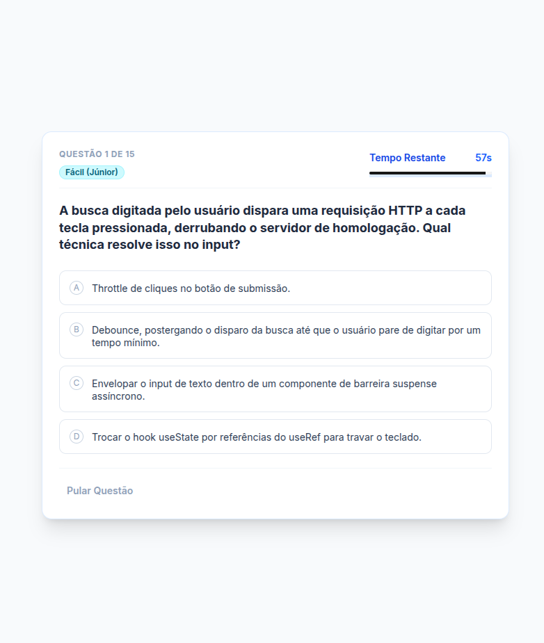
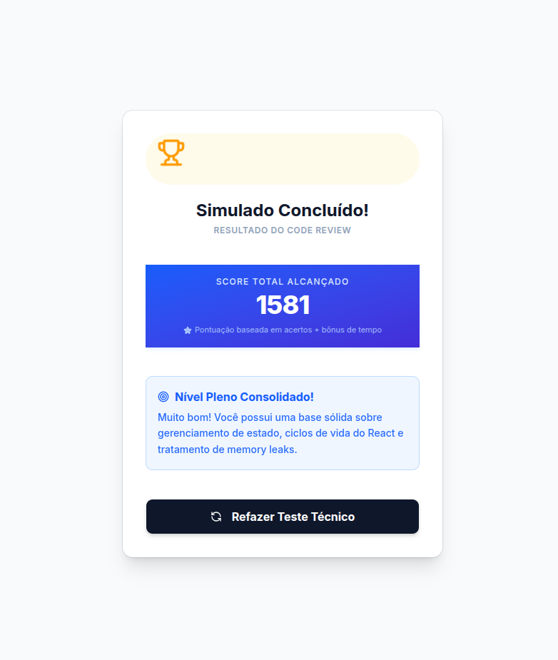

# 🐛 Live Coding Bug Quiz · Technical Simulator

Um simulador interativo de Code Review e testes técnicos focado na identificação e depuração de erros clássicos (bugs) em aplicações React e Next.js. O projeto foi arquitetado sob os princípios de Clean Architecture e projetado para treinar engenheiros de software para etapas de _Live Coding_ de processos seletivos.

## 🔗 Demonstração em Tempo Real / Live Demo

👉 **Acesse o simulador no ar:** [Live Coding Bug Quiz](https://vercel.app) _(Substitua pelo seu link final da Vercel após o build)_

---

## 📸 Demonstração Visual / Visual Presentation

### 1. Tela Inicial (Regras e Ambientação) / Welcome Screen

Apresentação das diretrizes do simulado: quantidade de questões, imutabilidade e o funcionamento do botão de pular.

### 2. Interface do Quiz (Simulador de IDEs) / Quiz Environment

Componentização mobile-first estruturada em tons de ardósia e estilo VS Code (Night Owl), rodando com cronômetro atômico e estados via Zustand.

### 3. Tela Final (Diagnóstico de Performance) / Final Evaluation Analytics

Mapeamento de acertos e diagnóstico de senioridade baseado no aproveitamento total do candidato.

---

## 🛠️ Tecnologias e Arquitetura do Sistema

- **Framework & Linguagem:** Next.js 14 (App Router) + React 18.3 + TypeScript 5 [src]
- **Gerenciamento de Estado:** Zustand v5 (Máquina de estados atômica controlando o progresso e o timer) [src]
- **Estilização & Componentes:** Tailwind CSS v3 + Base UI React + Shadcn Core + Lucide Icons [src]
- **Esteira de Testes:** Jest (Unitários) + React Testing Library (Integração) + Playwright (End-to-End) [src]

---

## 🛑 Regras de Negócio e Requisitos de Governança (RN)

### 1. Curva de Dificuldade Balanceada Crescente

O simulado gerencia estritamente **15 questões estruturadas**, divididas igualmente e distribuídas obrigatoriamente em uma ordem cronológica crescente de aprendizado:

- **Questões 01 a 05:** Nível Fácil (Foco em desenvolvedores **Júnior**).
- **Questões 06 a 10:** Nível Médio (Foco em desenvolvedores **Pleno**).
- **Questões 11 a 15:** Nível Difícil (Foco em desenvolvedores **Sênior**).

### 2. Randomização Isolada por Bloco

A cada nova inicialização ou reinício do simulado, o Zustand executa um algoritmo de embaralhação (_shuffle_) **isolado estritamente dentro das fronteiras de cada nível de senioridade**. As perguntas mudam de sequência de forma dinâmica, mas a curva crescente de aprendizado nunca é quebrada.

### 3. Imutabilidade de Resposta e Fluxo Procedural

- **Trava de Clique:** Assim que o usuário seleciona uma alternativa, o estado é congelado imediatamente (`RN-01`), impossibilitando cliques adicionais ou alterações de escolha.
- **Feedback & Explicação:** A interface sinaliza o veredito visual (Verde para correto / Vermelho para incorreto) e injeta na tela o painel de **explicação técnica analítica** detalhando o motivo do bug.
- **Gestão de Pulos:** O botão "Pular Questão" fica disponível apenas enquanto a pergunta atual não for respondida. Questões puladas avançam o estado imediatamente e não contabilizam pontos, sem gerar penalidades.

---

# 🐛 Live Coding Bug Quiz · English Version

A high-performance interactive tech-test simulator designed to train and evaluate software engineers' capabilities in identifying and fixing common programming errors (_bugs_) during real-time _Live Coding_ interviews.

## 🛠️ Tech Stack and Architecture

- **Core Engine:** Next.js 14 (App Router) + React 18.3 + TypeScript 5 [src]
- **State Management:** Zustand v5 (Decoupled Global State Store) [src]
- **Styling & Components:** Tailwind CSS v3 + Base UI + Shadcn Core [src]
- **Test Suite:** Jest + React Testing Library + Playwright E2E [src]

## 🛑 Critical Business Rules and Requirements Implemented

1. **Progressive Curve Balance:** The simulator runs exactly **15 structured questions**, sequentially distributed across balanced difficulty layers: Questions 1-5 (Junior), 6-10 (Mid/Pleno), and 11-15 (Senior).
2. **Isolated Block Shuffling:** Whenever a new quiz session triggers, the Zustand store runs an isolated random shuffle algorithms **strictly inside each difficulty tier boundaries**. The question sequence changes dynamically while maintaining the architectural learning curve stable.
3. **Answer Immutability Lock:** Once an alternative is chosen, the engine blocks additional selection events (`RN-01`). The interface color states immediately compute success (Green) or failure (Red), rendering a detailed code-review block explaining the bug's root cause.
